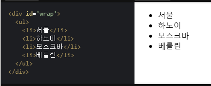

# DOM : Document Object Model

문서 객체 모델(Document Object Model)은 HTML, XML 문서의 프로그래밍 interface입니다.   
DOM은 문서의 구조화된 표현(structured representation)을 제공하며 프로그래밍 언어가 DOM 구조에 접근 할 수 있는 방법을 제공하여 문서 구조 및 스타일, 내용 등을 변경할 수 있게 도와줍니다.   

## DOM API 사용하기

```
<input id="search" class="search-input-style">
```   
<br>   


### 1. tag로 찾기   
```
document.getElementsByTagName('input') 
```
### 2. id로 찾기 (속도가 가장 빠른 특징을 가짐)   
```
document.getElementById('search')   
```
### 3. className으로 찾기   
```
document.getElementsByClassName('search-input-style')   
```
### 4. cssSelector로 찾기   
#### 일치하는 첫번째 엘리먼트   
```
document.querySelector('.search-input-style') 
```
#### 일치하는 모든 엘리먼트
```
document.querySelectorAll('.search-input-style')
```

<br><br><br>

# 간단미션

<br>

<br>   
베를린 뒤에 ‘뉴욕’을 자바스크립트를 이용해 추가하기   
<br><br>   

```
var node = document.createElement("LI");
node.innerText = "뉴욕";
document.querySelector("#wrap ul").appendChild(node);
```
<br><br>
٩( ᐛ )و 해결!