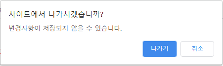

# BOM : Browser Object Model

BOM(Browser Object Model)은 웹 브라우저 환경의 다양한 기능을 객체처럼 다루는 모델입니다. 대부분의 브라우저에서 구현은 되어있지만, 정의된 표준이 없어 브라우저 제작사 마다 세부사항이 다르고 다소 한정적이라는 특징이 있습니다. BOM의 역할은 웹 브라우저의 버튼, URL 주소 입력 창, 타이틀 바 등 웹브라우저 윈도우 및 웹페이지의 일부분을 제어할수 있게끔 하는 것입니다. window 객체를 통해 접근이 가능합니다. 아래는 대표적인 BOM 객체들입니다.   

1) window: Global Context. 브라우저 창 객체
2) screen: 사용자 환경의 디스플레이 정보 객체
3) location: 현재 페이지의 url을 다루는 객체
4) navigator: 웹브라우저 및 브라우저 환경 정보 객체
5) history: 현재의 브라우저가 접근했던 URL history

## BOM API 사용하기   

<br>

탭을 종료시에 경고창이 나타남
```
window.onbeforeunload = function() {
    return '작성 중인 메시지가 있습니다.'
}
```   

결과   
<br>   
