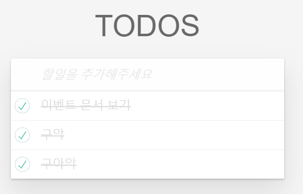

# EVENT

웹브라우저에서 어떠한 동작을 했을 때 일어나는 것들   
ex)클릭, 스크롤, 타자입력 등등..
<br><br>   

---
## 기본적인 이벤트의 종류 

<br>   

리소스 - load, unload, error   
뷰 - scroll, resize   
키보드 - keydown, keyup, keypress   
마우스 - click, dblclick   

(더 많은 이벤트 ``` https://developer.mozilla.org/ko/docs/Web/Events ```   )   
<br><br>   

---
## 이벤트 핸들러   

이벤트 등록 3가지 방법

1. HTML 이벤트 핸들러   
2. 전통적인 DOM 이벤트 핸들러   
3. **이벤트 리스너(Event Listner)**   
(3번째 방법만 소개)

<br><br>

<br><br>   

ex)버튼클릭시 alert창 띄우기   
```
<button>click me</button>
<script>
document.querySelector("button").addEventListener("click",function(){
  alert("hello event!");
})
</script>
```   
<br><br>   

---
## 이벤트의 흐름과 제어

<br>   
<br><br>   

이벤트 버블링: 이벤트가 사용자의 동작에 직접적으로 영향을 받은 노드로부터 바깥쪽으로 전파되어 나가는 방식.   

이벤트 캡쳐링: 이벤트가 가장 바깥쪽의 노드로부터 시작해서 안쪽으로 전파되어 들어오는 방식

<br>
간단한 예제<br>   

```
 <div class="one">
  <div class="two">
   <div class="three">
   </div>
  </div>
 </div>
 <script>
  var divs = document.querySelectorAll('div');
  
  divs.forEach(function(div) {
   div.addEventListener('click', logEvent);
   div.addEventListener('click', logEvent, { capture: true });
  });
  
  function logEvent(event) {
    console.log(event.currentTarget.className);
  }
  
  document.querySelector(".three").click();
</script>
```   
결과   
```
one
two
three
three
two
one
```
<br>   
이러한 전파에 대해서 제어(stopPropagation)도 가능하며, 기본 동작을 취소(preventDefault)할수도 있다!   

<br><br>

Event 객체는 이벤트가 발생했을 때 **이벤트를 발생시킨 요소**와 발생한 **이벤트에 대한 정보**를 제공.   
이것을 이용하여 이벤트를 위임하여 비슷한 형태의 여러 이벤트를 하나의 형태로 줄이거나, 동적으로 추가되는 요소들에게 적용시킬 수 있다!   
```
<ul id="parent-list">
    <li id="item1">Item 1</li>
    <li id="item2">Item 2</li>
    <li id="item3">Item 3</li>
</ul>

<script>
//상위 노드에 이벤트 설정
document.getElementById("parent-list").addEventListener("click", function (e) {            
   if (e.target && e.target.nodeName == "LI") {                
      console.log(`List item  ${e.target.id} was clicked!`);
    }
 });
</script>
```
<br><br>

---

## 간단미션
<br><br>

insertAdjacentHTML를 사용하여 새롭게 추가되는 li 태그에도 기존 이벤트가 적용하기   
(이벤트 위임을 통해서 해결)   
<br>
기존에는 하나의 요소에 대해서만 이벤트가 추가되어 있음
```
const $toggleInput = document.querySelector(".toggle");
$toggleInput.addEventListener("click", onToggleTodoItem);
```

위임을 통한 적용
```
document.getElementById("todo-list").addEventListener("click", function (e) {            
   if (e.target && e.target.nodeName == "INPUT" 
                && e.target.classList == "toggle") {    
      e.target.closest("li").classList.toggle("completed");
    }
 });

```

<br>
결과<br>   
<br><br><br>

٩( ᐛ )و 해결!
